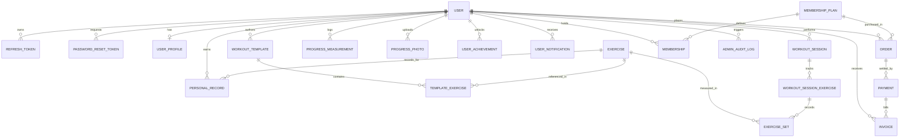

# Database Architecture & Data Modeling

## 1. Overview

The gym and fitness platform database is built on **PostgreSQL 16+** and orchestrated through **Prisma ORM 6**. It enforces strict referential integrity, cascading deletion policies, and compound indexes for high-throughput queries across millions of workout sets, payments, and user records.

---

## 2. Core Entities & Schema Architecture

---

## 3. Domain Entity Breakdown

### Identity & Access Control
- `User`: Central actor with credentials, email, verification flags, and `Role` (`USER`, `TRAINER`, `STAFF`, `ADMIN`, `SUPER_ADMIN`).
- `UserProfile`: Height, weight, fitness goals, activity levels, and preferences.
- `RefreshToken`: Cryptographic SHA-256 token hash storage with `jti`, device fingerprint, and expiration timestamps.
- `PasswordResetToken`: Secure one-time password recovery tokens with 15-minute TTL.

### Fitness & Exercise Catalog
- `Exercise`: Canonical and custom exercise library with category, muscle groups (primary & secondary), equipment, movement pattern, and instructions.
- `WorkoutTemplate`: Reusable routine blueprints with target sets, reps, RPE, rest intervals, and public/private visibility.
- `WorkoutSession`: Live or completed training instances recording start/end time, duration, volume (kg), and calories burned.
- `WorkoutSessionExercise`: Grouping of individual sets performed within an exercise during a session.
- `ExerciseSet`: Fine-grained set telemetry: set number, weight (kg), reps, RPE, warmup flag, and completion status.
- `PersonalRecord`: Automatically calculated records across 4 metrics: `HEAVIEST_WEIGHT`, `MAX_REPS`, `ESTIMATED_1RM`, `MAX_VOLUME`.

### Progress Tracking
- `ProgressMeasurement`: Time-series biometric entries (Weight, Body Fat %, Chest, Waist, Arms, Thighs, Hips, Calves).
- `ProgressPhoto`: Visual transformation captures categorized by `FRONT`, `BACK`, `SIDE`.

### Commerce & Memberships
- `MembershipPlan`: Plan tiers (Monthly ₹99, Yearly ₹550, Lifetime ₹1,200) with billing interval, currency, and feature flags.
- `Membership`: Active subscription state (`PENDING`, `ACTIVE`, `EXPIRING`, `EXPIRED`, `CANCELLED`) with automatic expiration date computation.
- `Order`: Cryptographic transaction orders with amount in paise/cents, idempotency key, and status (`PENDING`, `PAID`, `FAILED`, `CANCELLED`).
- `Payment`: Real payment execution records with gateway payment ID, UPI QR data, HMAC signature, and method (`UPI`, `CARD`, `NETBANKING`).
- `PaymentAttempt`: Gateway interaction retry logs for auditability.
- `Invoice`: Sequential, compliant tax invoice records (`INV-YYYY-XXXXX`) with line items, tax breakdown, and PDF download metadata.

### System Audit & Compliance
- `AdminAuditLog`: Append-only audit trail capturing admin identity, action type, target entity, previous state, and updated state.

---

## 4. Indexing & Optimization Strategy

1. **Foreign Key Indexes**: Every relation key (`userId`, `exerciseId`, `workoutSessionId`, `planId`, `orderId`) is indexed.
2. **Compound Indexes**:
   - `ExerciseSet([sessionId, exerciseId, setNumber])` for rapid set ordering.
   - `PersonalRecord([userId, exerciseId, recordType])` with unique constraint to maintain current PRs.
   - `UserAchievement([userId, achievementId])` unique constraint to prevent duplicate unlocks.
   - `Order([orderNumber, idempotencyKey])` for O(1) idempotent payment lookups.
3. **Query Indexes**:
   - `Exercise([category, difficulty, isPublic])` for multi-criteria catalog filtering.
   - `WorkoutSession([userId, startTime])` for historical analytics and streak calculation.

---

## 5. Transaction Safety & Concurrency

All multi-step state mutations use Prisma interactive transactions (`prisma.$transaction`):
- **Payment Verification**: Idempotently locks the order, transitions status to `PAID`, updates or creates `Membership`, generates sequential `Invoice`, and dispatches the domain event.
- **Workout Completion**: Calculates total volume, updates session status, checks and inserts newly achieved `PersonalRecord`s, and calculates workout streaks atomically.
